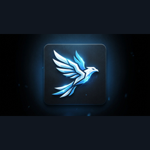

# Centerpiece Companion

**A free, open-source Windows companion built for the Finalmouse Centerpiece Pro community.**

Put useful controls and live information on your keyboard: four customizable plugin positions, music information, Twitch chat, weather, system readings, key remapping and a Caps Lock indicator—all while keeping your existing keyboard skin.

**[Download the Windows app](https://github.com/lilwoii/centerpiece-companion/releases)** · [Keyboard shortcuts](#keyboard-shortcuts) · [Getting started](#getting-started) · [Troubleshooting](#troubleshooting) · [Privacy](PRIVACY.md)

This is an **unofficial community preview** for the **68-key Centerpiece Pro**, independently maintained and not affiliated with or endorsed by Finalmouse. It is not replacement firmware or a complete implementation of every advertised keyboard integration. The current release has been tested on the owner's keyboard; broader compatibility depends on community feedback.

## Download and install

1. Open the [GitHub Releases page](https://github.com/lilwoii/centerpiece-companion/releases).
2. Open the newest release and download **Centerpiece-Companion-Setup-….exe** under **Assets**.
3. Run the installer. Choose your **app folder** and **future update-download folder**. These can be on different local drives.
4. Launch **Centerpiece Companion**.

**You only need one `.exe`.** It includes the app and its required components. No GitHub account, Node.js, developer tools, source ZIP, `.blockmap` or `.yml` downloads are needed. GitHub also lists files the updater uses automatically.

Requirements: Windows 10/11 x64 and a connected 68-key Centerpiece Pro. Internet access is needed for online connections, community features, weather and update checks. The installer is currently unsigned, so Windows may show a publisher warning. Download from this repository's releases.

Your settings remain in your Windows account even if the app is installed on another drive. Windows still needs free space on its system drive.

## What you can do

| Area | Available features |
| --- | --- |
| **Plugin library** | Four positions with recognizable logos; assign media actions, app/website launchers, configured shortcuts and supported OBS controls. |
| **Screen widgets** | Spotify artwork, track information and progress; local time; weather; CPU/GPU readings; microphone status; Twitch chat; custom text. |
| **Keyboard editor** | Click a physical key or press it to select it; change bindings, swap keys, choose display layouts and configure a Caps Lock color indicator. |
| **Connections** | Configure your own Twitch, local OBS, weather and optional sensor connections. |
| **Feature requests** | Sign in with Discord, post ideas with timestamps and choose a display-name color. |
| **Community skins** | Browse the public XPANEL catalog with previews and official downloads, plus owner-approved skin links. |
| **Background operation** | Keep controls running in the tray, optionally start with Windows, and update from inside the installed app. |

The catalog includes Spotify, YouTube, Twitch, OBS, Discord, Steam, Kick, Streamlabs, voice tools and more. **A catalog logo does not mean a full native integration:** some entries launch a website or app, while others send a shortcut you configure in that service. Elgato/Stream Deck plugin packages cannot be imported directly.

## Getting started

1. Connect your Centerpiece Pro and wait for the companion to detect it.
2. Save or discard any pending XPANEL edits, then **close XPANEL** before setup or keyboard edits.
3. Click **Set up my keyboard** if the setup banner appears. Let setup finish before disconnecting the keyboard.
4. Open **Plugin library**, choose a position under **On your keyboard**, then choose a logo and an action. Complete any required action settings and apply the assignment. Repeat for up to four positions.
5. Open **Screen widgets**, choose what to display above the Up arrow, and apply it. Configure its connection first if needed.
6. Try the shortcuts below. Closing the app window leaves the companion running in the tray.

Setup saves a local backup, assigns the companion shortcuts and reserves overlay slots 2–10. It stops if a required slot contains an overlay it does not own. Your installed skin remains in place. Keep your local keyboard backup for restoration.

## Keyboard shortcuts

**L1 means the keyboard's physical L1 layer key.** For a combination, hold L1 and tap the other key.

| Shortcut | What it does |
| --- | --- |
| **L1 + P** | Enter plugin mode. Press it again to exit. |
| **Up / Down**, in plugin mode | Move between the four plugin positions. **Release L1 first.** |
| **Enter**, in plugin mode | Run the selected action and exit plugin mode. |
| **Esc**, in plugin mode | Exit without running an action. |
| **L1 + /** | Cycle screen widgets independently of plugin navigation. Each selection is saved. |
| **Hold L1** | Show the P and / hints in your chosen L1 color, or your Caps Lock on-color. |
| **Caps Lock** | Toggle Caps Lock normally and update its configured indicator. It also exits plugin mode. |

Plugin mode exits automatically after **45 seconds without input**. Outside plugin mode, the arrow keys and Enter work normally. Existing XPANEL play/pause, previous/next and volume bindings remain usable.

**Example:** Hold L1, tap P, release L1, press Down to select a position, then Enter to run it. To change the small information widget instead, hold L1 and tap /.

### Widget rotation and “Follow selection”

L1 + / cycles through:

**Spotify → Local time → Weather → CPU → GPU → Microphone → Twitch → Custom text → Off → Spotify**

Plugin navigation does **not** intentionally change a fixed widget. **Follow selection** is a separate, optional choice in Screen widgets that deliberately links the widget to the selected plugin. It is excluded from L1 + / cycling. Choose a fixed widget to keep the two controls independent.

The companion must remain running, including in the tray, for these controls and live widgets to work. Saving a setting does not make the live companion run inside the keyboard firmware.

### Optional desktop media shortcuts

In **Media controls**, enable shortcuts if you want these additional bindings:

| Shortcut | Spotify action |
| --- | --- |
| **Ctrl + Alt + Left** | Previous track |
| **Ctrl + Alt + Space** | Play / pause |
| **Ctrl + Alt + Right** | Next track |

These are optional. If another app owns one of the combinations, the companion reports the conflict. L1 + P and L1 + / are reserved for companion navigation; avoid assigning their internal Ctrl + Alt + P and Ctrl + Alt + F12 signals to other actions.

## Configure your connections

### Spotify

Open the **Spotify desktop app** and start a track. The companion reads its Windows media session for track information and playback controls; no Spotify developer registration or password is needed. Choose the Spotify screen widget and apply it to show artwork and progress.

### Twitch chat

1. Open **Connections → Twitch chat**.
2. Enter a channel name or Twitch link.
3. Click **Connect with Twitch** and complete the browser approval, using the displayed code if prompted.
4. Choose the Twitch widget in Screen widgets and apply it.

Community users do not need to register a Twitch application or paste an access token. Access is read-only; the companion does not send chat messages. The connection is encrypted and saved locally. The small screen displays limited text, not a full desktop chat window.

### OBS Studio

In OBS, open **Tools → WebSocket Server Settings**, enable the server, and use its port and password in the companion's **Connections** page. The companion connects to OBS on the same PC. Assign actions such as recording toggle, replay-buffer save, scene switching or input mute in Plugin library. Enter exact scene/input names where requested. OBS must be running and its relevant feature configured. Its password is kept in memory for that session.

### Weather, temperatures and microphone

Use **Connections → Local weather** to choose Windows location or search for a city, then choose °F or °C. Windows location needs the relevant Windows permission; manual city selection is available if it cannot be read. Weather refreshes approximately every ten minutes.

CPU load is available without an additional sensor driver. NVIDIA temperature uses the installed `nvidia-smi` tool when available. Other temperature readings require an existing **Libre Hardware Monitor** web server on `127.0.0.1:8085` and the sensor option enabled in Connections. Missing readings show as unavailable; this app does not install a sensor driver. Microphone mute targets the default Windows communications input and does not record audio.

For Discord, voice effects, soundboards and similar actions, configure a shortcut in the target application and assign the matching **Send configured shortcut** action in the companion.

## Customize your keyboard

In **Keyboard editor**, use **Refresh bindings**, then click a key on the displayed keyboard. Alternatively, click **Press a key to select** and press the physical key within ten seconds while the app is focused.

Choose **Base layer** or **L1 layer**, select a new binding and any modifiers, then use **Save binding to keyboard**. Use **Swap these keys** to exchange supported bindings. The companion backs up edits and checks the saved keymap. L1 and the L1 + P / L1 + / positions stay reserved.

For the Caps Lock indicator, enable **Caps Lock color**, choose on/off colors and apply the indicator. For L1 hints, keep **Match Caps Lock color** enabled or choose a custom color. The current UI may call this the P color; it applies to both P and /.

QWERTY is the default display layout. **Browse Windows layouts** offers other available layouts, including Russian and Korean. Applying labels does not change Windows typing settings or add physical keys. Select the matching Windows input language with **Win + Space**; languages that require an IME still need it configured in Windows.

**Read device settings** displays supported profile, actuation and rapid-trigger information. Keyboard temperature is not reported by the current integration.

## Community requests and skins

Open **Feature requests → Sign in with Discord**, approve in your browser, then enter a title and description and submit. Your Discord display name, chosen color, request and timestamp appear in the community feed and are sent to the owner's Discord review channel. The session is saved locally so you normally do not need to sign in each time.

To submit a skin, choose **Submit a skin link**, provide an HTTPS download link and confirm that you created it or have permission to share it. Approved links appear in **Community skins** with creator credit. Review does not guarantee acceptance.

**Community skins → XPANEL community** includes all 69 skins in the public catalog at release, with creator credits and preview images. Search by skin or creator, use **Show more skins** to browse the entire list, and **Refresh XPANEL** to fetch new listings. The bundled catalog remains available if refresh fails; preview images require internet access. **Download skin** opens the original XPANEL download in your browser. Install downloaded skins using XPANEL; the companion does not automatically install files or change your current skin.

File uploads are not enabled. Submit an HTTPS download link for owner review; file hosting remains with its original provider.

## Tray, updates and removal

Closing the window keeps the companion running. Right-click its Windows tray icon to open it again, enable/disable **Start with Windows**, or **Quit companion**. Quit stops live controls and restores the prior overlay selection.

For updates, use **Check for updates → Download update → Restart & update**. The installed app also checks after startup and periodically while running. Future updates become available when the maintainer publishes a newer GitHub release with its installer and update files. They are not silently installed. The update wizard retains the ability to choose app and future-download folders; you do not need to uninstall first.

To remove the companion's keyboard assignments, first use **Connections → Restore original plugin key**. This restores the backed-up L1 + P and L1 + / actions and previous overlay selection while preserving your other remaps. Reserved cached images remain stored. Then quit and uninstall if desired. Keep the backup in your Windows profile until restoration is complete.

## Troubleshooting

| Problem | What to check |
| --- | --- |
| Keyboard not connected | Save/close XPANEL, check the USB connection and use **Reconnect keyboard**. |
| L1 shortcuts do nothing | Confirm setup completed, the companion is running in the tray and no shortcut conflict is reported. Release L1 before using arrows in plugin mode. |
| Widget changes with plugin selection | Select a fixed widget instead of **Follow selection**. |
| Blank or unavailable widget | Check its connection in Connections, then apply it in Screen widgets. Custom text needs text entered; Off intentionally hides the widget. |
| Spotify progress is paused or stale | Start playback in the Spotify desktop app and check the media status shown in the companion. |
| Temperature says “No sensor” | Check the supported NVIDIA tool or your local Libre Hardware Monitor server. |
| Automatic updates require an installed release | Install the release `.exe` and launch the installed app, rather than a development/test copy. |
| Update download fails | Check internet access and free space on the chosen update drive. You can also download the newest installer from GitHub and install over the existing copy. |
| A request is rate-limited | Wait for the indicated retry interval. Do not repeatedly resubmit. |
| Typing unexpectedly stops | Quit the companion. If necessary, unplug/reconnect the keyboard to restore typing, and report the issue before reopening the app. Include the app version and what you were doing. |

Report reproducible issues through [GitHub Issues](https://github.com/lilwoii/centerpiece-companion/issues) or use Feature requests in the app. Describe the version, steps, expected result and actual result. Do not attach credentials or your entire AppData folder.

## Privacy, contributions and license

Keyboard settings and backups stay in your Windows profile. Spotify uses your existing Windows media session. Saved Twitch and community session credentials use Windows-backed encrypted storage; OBS passwords are session-only. Online services receive the data needed for their features, such as weather coordinates or submitted community requests. See the [full privacy explanation](PRIVACY.md).

Contributions and feedback are welcome. Developers can read the [plugin guide](PLUGIN-GUIDE.md) and [UI behavior contract](UX-CONTRACT.md). Changes should preserve normal typing, existing skins, local backups and the independent plugin/widget controls. A catalog entry should clearly state whether it is a native integration, launcher or configured shortcut.

Original project code is available under the [MIT license](LICENSE). Service names and logos belong to their respective owners. Weather data is provided by [Open-Meteo](https://open-meteo.com/) with attribution under CC BY 4.0.

**Sharing with other owners? Send them the [public download page](https://github.com/lilwoii/centerpiece-companion/releases), not your personal app-data folder.**

If Windows denies access to your selected update folder, the app asks you to choose another writable folder on your preferred drive and remembers that choice for your Windows account. Cancel leaves the current app installed.

### Quiet automatic startup

Enable **Start with Windows** in the app’s left sidebar (or its tray menu). When you sign in to Windows, the companion starts in the system tray with no window or taskbar button, loads saved settings, and runs live widgets and plugin controls. Spotify itself must be playing for live track information. Double-click the tray icon to open the app. Uncheck the setting to stop automatic startup.

Saved key mappings remain on the keyboard, but live Spotify data, widgets and companion plugin actions require the background app. Closing the window keeps it running; **Quit companion** stops live controls.

Future releases install through **Check for updates → Download update → Restart & update**. Installation runs quietly and preserves locations and personal settings. Existing users do not need to download or run a separate installer manually.

Spotify track changes are checked at a short interval while Spotify is connected, and changed track details trigger a display refresh without waiting for the regular display timer. Requests remain serialized; Windows media reporting and USB transfer time can still add delay.
